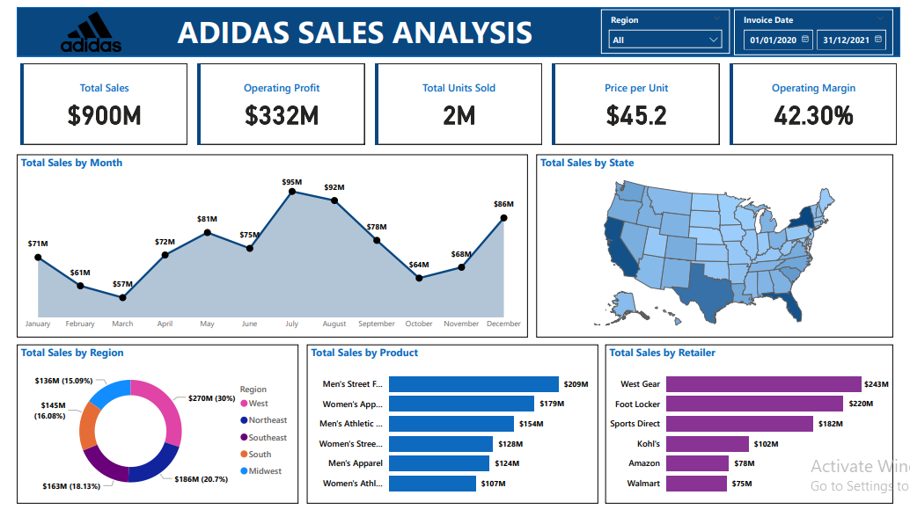

# Adidas_Sales_Analysis
This project provides an in-depth analysis of Adidas' sales performance across various dimensions, including geography, product, and retailer. It highlights key trends, actionable insights, and recommendations to enhance sales and profitability.
# Adidas Sales Analysis

## Overview
This project provides an in-depth analysis of Adidas' sales performance across various dimensions, including geography, product, and retailer. It highlights key trends, actionable insights, and recommendations to enhance sales and profitability.

## Key Features
- **KPIs**: Total Sales, Operating Profit, Sales Volume, Price per Unit, Operating Margin.
- **Visuals**:
  - Area Chart: Total Sales by Month.
  - Filled Map: Total Sales by State.
  - Donut Chart: Total Sales by Region.
  - Bar Charts: Sales by Product and Retailer.
- **Interactivity**: Dynamic filtering with Region and Invoice Date slicers.

## Tools Used
- **Power BI**: For data visualization and dashboard creation.
- **Dataset**: Cleaned and prepared for analysis.

## Insights
1. **Seasonality**: Sales peaks in July and August; February underperforms.
2. **Regional Dynamics**: West leads in sales; Northeast underperforms.
3. **Product Performance**: Men’s Street Footwear and Women’s Apparel dominate.
4. **Retailers**: West Gear and Foot Locker are top performers.

## Recommendations
- Strengthen marketing during peak months.
- Focus on underperforming regions and products.
- Enhance collaborations with key retailers.
- Regularly update and leverage the interactive dashboard.

## Dashboard Preview

# Adidas Sales Analysis Documentation

## Project Overview

The Adidas Sales Analysis project aims to provide a comprehensive understanding of Adidas' sales dynamics and performance drivers. The analysis helps in identifying geographical areas with high and low sales potential, insights into product performance, pricing strategies, and actionable recommendations to optimize sales and profitability.

## Dashboard Overview

The dashboard visualizes key sales performance metrics using Power BI. It enables users to explore trends, compare sales across different dimensions, and interactively analyze Adidas' business performance. The dashboard includes multiple charts that present sales data effectively.

## Key Performance Indicators (KPIs)

- **Total Sales:** $900M – Provides an overview of Adidas' sales performance.
- **Operating Profit:** $332M – Indicates the total profit generated across different dimensions.
- **Total Units Sold:** 2M – Highlights the overall product demand.
- **Price per Unit:** $45.2 – Helps in assessing Adidas' pricing strategy.
- **Operating Margin:** 42.30% – Evaluates the profitability of sales transactions.

## Methodology

1. **Data Cleaning:**
   - Checked for blanks and duplicate values in all columns (none found).
   - Ensured the dataset was ready for analysis.
2. **Data Importation:**
   - Imported the dataset into Power BI.
3. **Dashboard Creation:**
   - Created a structured layout with a clear header and key performance indicators.
   - Used different visualization techniques to represent the data effectively.
4. **Interactivity Enhancement:**
   - Added slicers for filtering by region and invoice date.
   - Edited interactions to ensure charts dynamically update based on selections.

## Files

- **`adidas_sales_analysis_dashboard.png`** – The final dashboard visualization.
- **`dataset.xlsx`** – Raw sales data used for analysis.
- **`README.md`** – Documentation for the project.

## Tools and Techniques

- **Power BI** – Used for data visualization and dashboard creation.
- **Data Cleaning Techniques** – Ensured dataset accuracy and completeness.
- **Interactive Filtering** – Enabled better insights through data exploration.
- **Charts & Graphs:**
  - **Area Chart:** Total sales by month.
  - **Filled Map:** Total sales by state.
  - **Donut Chart:** Total sales by region.
  - **Bar Charts:** Total sales by product and retailer.

## Key Insights

- **Sales Trends:** Sales peaked in July at $95M but dropped in February ($61M) and November ($64M), indicating seasonal trends.
- **Regional Performance:** The West region contributed the highest sales ($270M), whereas the Northeast had the lowest ($136M).
- **Best-Selling Products:** Men's streetwear ($209M) was the top-performing product, while women's athletic wear had relatively lower sales.
- **Retailer Sales Contribution:** West Gear ($243M) led among retailers, while Walmart had the least sales ($75M).

## Recommendations

1. **Optimize Seasonal Promotions:** Strengthen marketing efforts before peak months (e.g., June) to maximize sales.
2. **Regional Growth Strategies:** Increase marketing investment in underperforming regions (e.g., Northeast) to improve sales.
3. **Product Inventory Optimization:** Focus on stocking high-demand products such as men's streetwear and women's apparel.
4. **Retailer Partnership Strategy:** Strengthen partnerships with top-performing retailers like West Gear and Foot Locker.
5. **Profit Margin Enhancement:** Reassess pricing strategies to maintain a high operating margin while ensuring affordability for customers.

